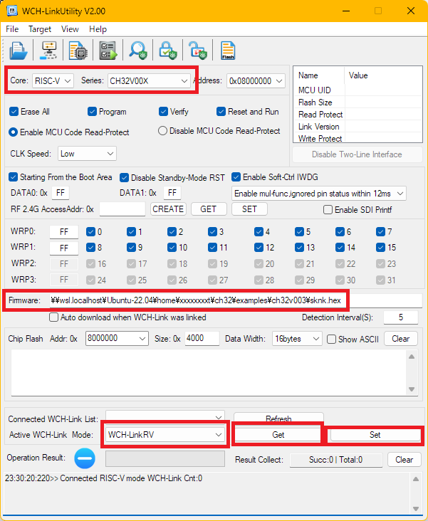

# しかのこまるこふこしたんたん基板ファームウェア

これは、 コミックマーケット104(以下 C104)で初頒布した、
 「しかのこまるこふこしたんたん基板」のファームウェアです。

 突貫工事で作成したためビルド方法が煩雑になっていますがご了承ください。

 ## ビルドの準備

まず、以下のページを参考Rustの開発環境をインストールします。
OSはどれでも大丈夫なはずですが、実際のファームウェアの開発に使用した、Ubuntu22.04(WSL)をお勧めしておきます。

https://www.rust-lang.org/ja/learn/get-started

Ubuntuの場合、追加で以下のコマンドの実行が必要でした
    $ sudo apt update
    $ sudo apt install -y build-essential

次に、 ソースがビルドできるようにするため、以下のコマンドを実行してください。

    $ rustup install nightly
    $ rustup default nightly
    $ rustup component add rust-src --toolchain nightly-x86_64-unknown-linux-gnu

## リポジトリの取得とファームウェアビルドの準備

次に、以下のリポジトリを clone してください。

https://github.com/ch32-rs/ch32-hal

今回作成したファームウェアは、このリポジトリにあるサンプルコードを書き換えることで作成したため、まずはサンプルコードのビルドを行います。

clone したら、 `examples/ch32v003` に cd した後に以下のコマンドを実行します。

    cargo build --release

すると、多少の警告は出るもののビルドに成功するはずです。
そして、`target/riscv32ec-unknown-none-elf/release/blinky` がファームウェアの元になったアプリの実行ファイルです。

## ファームウェアのビルドと変換

ここまできたらもう少しです。
このリポジトリの `e-sknk.rs` 内容を `src/bin/blinky.rs`(リポジトリのトップからだと`examples/ch32v003/src/bin/blinky.rs`)に上書きします。

その後、再度

    cargo build --release

を実行するとファームウェアのバイナリが得られます。
ただ、ここで得られたバイナリはファームウェアの書き込みに用いる
アプリが対応していない形式であるため、変換が必要です。

変換は以下のコマンドで行えます。

     objcopy -O ihex target/riscv32ec-unknown-none-elf/release/blinky sknk.hex

これで出来上がった `sknk.hex` が目的のファイルです。
あともう一息です。

## ファームウェアの書き込み

ファームウェアの書き込みには、 WCH-LinkEエミュレーター というハードウェアを使用します。
また、メーカーの[サイト](https://www.wch-ic.com/products/WCH-Link.html)より
 WCH-LinkUtility という Windows アプリ(ページ最下方)をダウンロード(zip形式)して
展開しておきます。

WCH-LinkEエミュレーターを接続した後、展開した中にある`WCH-LinkUtility.exe`を起動すると下記のようなウィンドウが表示されます。

表示されたら、ハードウェアのモードを切り替えるため、
下部の Get を押下→すぐ左のプルダウンで「WCH-LinkRV」を選択→ Set を押下
と操作します。

次に、書き込む相手を設定するため、上部の　Core と Series を画像の通りに設定します。

そして、書き込むファームウェアのファイルを中ほどの Firmware の欄に指定します。

ここで 書き込み対象のマイコンを WCH-LinkEエミュレーター に接続し、
上部のメニューから「Target」→「Query Chip Info」を選択するとウィンドウ右上のリスト部に
マイコンの情報が表示されます。
表示されない場合は接続が間違っている可能性があるので確認してください。

最後に、 上部のメニューから「Target」→「Program」を選択すると、
ファームウェアがマイコンに書き込まれます。
